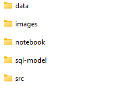
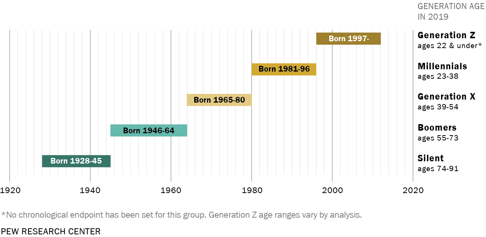
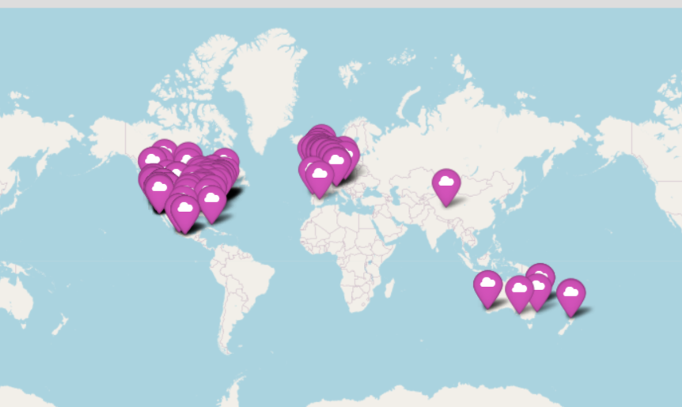

# Proyect-1: TOP SONGS & ARTISTS DATA ANALYSIS


**Objective**: This project aims to analyze the most popular songs and artists of the last years. 
To achieve this goal I will manipulate and analyze a complete and complex dataset, adding information through an API and loading the generated database to SQL.    

                What music is Trending? Why is it trending?
This Exploratory Data Analysis(EAD) project will end with several conclusions about what has been trending in the world of music in recent years. Thanks to the data set generated you will discover some elements that you may not know yet, so continue reading... you won't regret it!

## Repository Structure
---
Besides this read me you will find the following folders:


- Data folder: you will find all the csv data files used for this project.
- Images folder: you will find all the images related to this project.
- Notebook folder: inside this folder you will find the following jupyter notebooks:   
    - *Spotify Cleaning*: notebook related to all the extractions and cleaning of the dataset. It will integrate data extraction, cleaning and manipulation.
    - *API ticketmaster_events* : Notebook to integrate addotional information through ticketmaster API.
    - *SQL Spotify Songs and Artists*: Notebook with the code to load the dataset to SQL.
    - *Conclusions*: notebook with interesting conclusions about the project.
- sql-model: the SQL transcript to generate a SQL model with the project database.
- src: a .py file with functions used in this project

## Data extraction
---
Datasets extracted from [Kaggle Data Sets](https://www.kaggle.com/datasets):

- Main dataset: **"Spotify Top 200 Charts (2020-2021)"**
This dataset includes information about all songs that have been on Spotify Top 200 Weekly (Global) charts in 2020 and 2021

- Addtional dataset: **"Spotify Artist Metadata Top 10k"** that will add the following information about the artist: *gender, age, type, country* to the main dataset

## Cleaning  
----
In the jupyter notebook: notebook/Spotify Cleaning you will find the cleaning process
 -   **"Spotify Top 200 Charts (2020-2021)"** shape is (1556, 22) and has the following columns: 'Highest Charting Position', 'Number of Times Charted',
       'Week of Highest Charting', 'Song Name', 'Streams', 'Artist',
       'Artist Followers', 'Song ID', 'Genre', 'Release Date', 'Weeks Charted',
       'Popularity', 'Danceability', 'Energy', 'Loudness', 'Speechiness',
       'Acousticness', 'Liveness', 'Tempo', 'Duration (ms)', 'Valence',
       'Chord'
- With an inner merge with the dataset **"Spotify Artist Metadata Top 10k"** we will add to the dataset the following info:*gender, age, type, country* of the artist. Complete df.shape (1157, 26)

### Cleaning Process:
- df.dtypes: make sure the columns types are correct
- Null values: will eliminate null values row ONLY if null values are <1% of the total values of the column

### Data manipulation: 
- **Genre**: Song [Genre] column has the following format:"['indie rock italiano', 'italian pop']". It gives a string with one or more specific genres for the song. With this information I have created 3 columns: 
    - "Genre1": using regex this column will give the first genre inside the string in [Genre] column. Ex. input: "['indie rock italiano', 'italian pop']" output: 'indie rock italiano'. This column will be later rename as [Subgenre]
    - "Genre2": using regex this column will give the second genre (if any) inside the string in [Genre] column. Ex. input: "['indie rock italiano', 'italian pop']" output: 'italian pop'. This column will be later rename as [Subgenre_2]
    - "Genre_Gen": using funzzywuzzy this column will give a more generic song genre inside the list : *"pop", "hip hop", "latin", "rock", "dance pop", "rap", "trap", "pop rock", "funk", "reggaeton", "r&b", "edm", "drill"*

- **Week_Of_Highest_Charting**: this column gives you the week when the spotify song was on higuest charting: Ex. "2021-07-23--2021-07-30". With this information I have created the following columns:
    - "Week_Of_Highest_Charting" will give the start of the week when the song was most charted. Ex. 2021-07-23
    - "Month_Highest_Charting", will give you the month. Ex. July
    - "Season_Highest_Charting" will give you the Season. Ex. Summer
    - "Year_Highest_Charting" will give you the Year. ex 2021

- **Gender**: This column gives you the Artist Gender. We had 4 genders: mixed (for group singers), male, female and other. For "other" a function will determine the singer gender. Then, to reduce for *nan* values gender_guesser.detector will be used to detect with the artist name if its a female or a male. 

- **Country**: This column gives the country of the artist. It is the column with more null values (12.8%) to reduce this percentage we will use selenium webscraping which will go to [Music Brain web](https://musicbrainz.org/) to search the nationalities of the artists.

- **Age**: This columns gives the age of the artist but since the age doesnt seem very accurate, I will add a column [Artist_generation] to allocate the following generations:  For this we are assuming all artists can produce a song from their birth to the present day, if not, necessary corrections will be made.


### Data Structure

- Drop the columns that will not be needed: "Highest_Charting_Position","Number_Of_Times_Charted", "Song_Id", "Genre", "Age", "Weeks_Charted"
- Drop null rows (condition <1% of the column)
- df.shape: (1143, 28)
- df.columns: 
['Song_Name', 'Genre', 'Subgenre', 'Subgenre_2', 'Release_Date',
       'Song_Decade', 'Streams', 'Week_Of_Highest_Charting',
       'Month_Highest_Charting', 'Season_Highest_Charting',
       'Year_Highest_Charting', 'Popularity', 'Danceability', 'Energy',
       'Loudness', 'Speechiness', 'Acousticness', 'Liveness', 'Tempo',
       'Duration_(Ms)', 'Valence', 'Chord', 'Artist', 'Artist_Followers',
       'Gender', 'Artist_Generation', 'Type', 'Country']


## Enrich data through an API
----

I will request to ticketmaster API to provide me, if any, futur events related to the artists of my dataset. The following information for events all around the wold: *Event_Name, url, Country	City, Location* will enrich spotify dataset.



## Load data to SQL 
----
 I will create a Scema in SQL:

 


# Tools used for the project
import folium
import os 
from dotenv import load_dotenv
Selenium
import re
gender_guesser.detector
import numpy as np
import datetime


- Enriquece tus datos: alimenta tus datos extrayendo de otras fuentes de datos. Recuerda que tienes muchísima herramientas al alcance de tus manos para ello.
    - Llamadas a APIs.  
    Nota: La API que utilices puede requerir autenticación a través de token.

    - Web Scraping, que puede ser usando Selenium o BeautifulSoup. 
    
    Si quieres utilizar mas de una de estas herramientas, puedes. El limite es el cielo. **Pero al menos tienes que usar una.**

-  ¡Los datos que traigas para enriquecer el conjunto de datos inicial tendrán que estar relacionados con él y complementarlo! 


# Desafio [Exploratory Data Analysis (EDA)]
---


El Análisis Exploratorio de Datos o en inglés Exploratory Data Analysis (EDA) es un método de análisis de los conjuntos de datos para resumir sus principales características. Recuerda que implica el uso de gráficos y visualizaciones para explorar y analizar tu conjunto de datos. El objetivo es explorar, investigar y aprender, no confirmar hipótesis estadísticas.


A partir de todos los datos recolectados. Deberas importarlos, usar tus habilidades de gestión de datos para limpiarlos, analizarlos y luego exportarlos como un archivo de datos CSV limpio. 


## TO DO's
---

- Decide tus hipótesis o preguntas de investigación. Ten en cuenta que a lo largo del proyecto surgirán nuevas preguntas de gran valor. Pero cuidado con complicarte la vida; gestiona tu tiempo y focaliza tus esfuerzos en lo realmente importante. 

- Explora los datos y describe lo que has encontrado.
Puedes usar: `df.describe()`, `df["column"]`... etc.

- Usa al menos 5 técnicas de limpieza de datos dentro de un jupyter notebook. Recuerda analizar valores nulos, borrado de columnas, datos duplicados, manipulación de strings, aplicación de funciones, expresiones regulares, etc.

- Crea al menos cinco gráficos que sean perspicaces.

- Muestra datos que validen las conclusiones basadas en tus hipótesis en un jupyter notebook.

- Crea una narración convincente en torno a tus hallazgos. ¡Piensa en tus stakeholders y convence los con tus conclusiones! Recuerda que cualquiera puede acabar en tu repositorio; incluyendo los recruiters. (Algunas diapositivas con poco texto y tramas bonitas suelen ser útiles) 


## Sugerencias
---
- Examina los datos e intenta comprender qué significan los campos antes de sumergirte en los métodos de limpieza y manipulación de datos.


- Averigua cómo encajan y cómo preparar los datos de ambas fuentes para tu informe. Algunas sugerencias sobre cómo podrías lograr esto:

    - Tienes un conjunto de datos. Ahora puede usar una API usando los datos de una columna y crear una nueva con información valiosa de tu respuesta para cada fila.

    - Fusionar dos conjuntos de datos es complicado: necesitarías al menos la misma columna con los mismos datos en ambos. No pienses demasiado en esta etapa. Puedes establecer la relación de ambas fuentes de datos a través de una visualización.
    -  Crea algunos informes que contengan datos valiosos del conjunto de datos + enriquecimiento. 

    - Simplemente resume los datos y genera algunas estadísticas básicas ( mean, max, min, std, etc.).

    - Realiza estadísticas basadas en agregaciones de datos utilizando groupby().

    - Vuelve te loco con la investigación.

- Divide el proyecto en diferentes pasos: usa los temas cubiertos en las lecciones para formar una lista de tareas.

- Compromete te con el proyecto y se constante, no tengas miedo de hacer algo incorrectamente porque siempre podrás retroceder a una versión anterior. Los **commits** te ayudaran en esta tarea. 

- Consulta la documentación y los recursos proporcionados para comprender mejor las herramientas que estas utilizando.


# Desafio [Data Pipeline]
---


¿Qué es un pipeline?
Un pipeline de datos es una serie de procesos de datos en los que la salida de cada uno es la entrada del siguiente, formando una cadena.

Esto es super útil para cuando necesitemos una misma función en distintos proyectos para reutilizarlos. 

Para este apartado, deberas construir un pipeline de datos que procese los datos y produzca un resultado. Debes demostrar tus competencia con las herramientas que cubrimos en clase: funciones, clases, listas comprimidas, operaciones de strings, pandas y manejo de errores ... etc.


## TO DO's
---
Los requisitos técnicos para esta parte del proyecto son los siguientes:

- Debes construir una pipeline con la mayoría de tu código envuelto en funciones.

- Debes cubrir las siguientes etapas del pipeline de datos: adquisición de datos, limpieza, análisis e informes.

- Debes demostrar todos los temas que cubrimos hasta ahora (funciones, listas comprimidas, operaciones con strings, etc.) en tu procesamiento de datos.

- Deberá haber algún conjunto de datos que se importe y algún resultado que se exporte.

- Tu código debe guardarse en un archivo ejecutable de Python (.py) el cual deberá estar en una carpeta/directorio llamado `src`.


# Desafio [Carga en BBDD]
---


Para este desafío tendrás que generar una base de datos con los datos tratados de la extracción. 

Podrás hacerlo con MongoDB o con SQL. Eres libre de elegir la que quieras, pero por lo menos una de ellas deberá estar presente en tu proyecto. 

## TO DO's
---

- Si utilizas SQL 
    - Crear un modelo de datos con varias tablas y sus relaciones. 
    - ER Diagram (Esquema de relaciones entre tablas)
    - Adjuntar el código de creación del modelo de bbdd.
    - Generar un jupyter notebook con todo lo necesario para la carga de datos. 

- Si utilizas MongoDB 
    - Generar un jupyter notebook con todo lo necesario para la creación de colecciones necesarias. 
    - Incluir en un jupyter notebook todo lo necesario para la carga de datos. 


## .gitignore
---
Recuerda que hay cierta información sensible. Restringela con el `.gitignore`
    - Tokens
    - Datos protegidos por licencias o exigencias del propietario / creador de esa fuente de información. Lee bien la documentación por si las moscas


## README.md 
---

Aquí es donde presentas tu proyecto, donde tienes que venderte y cautivar al lector. Debes incluir la  motivación del proyecto en la introducción. Ademas tendrás que incluir las hipotesis inciales, los pasos que has seguido, tus conclusiones, las tecnologías usadas y las fuentes de las que has obtenido tus datos.  

## Estructuras de carpetas 
---
- data: aquí irán todos los datos del proyecto. Los inputs como los outputs. Recomendamos hacer sub carpetas dentro de data. 

- notebooks: aquí irán todos los jupyters utilizados dentro del proyecto. Recuerda que el nombrado deberá ser descriptivo de la tarea de su contenido. Ademas deberá estar numerados para su mejor entendimiento.

ejemplo :

```
1-extraccion_csv.ipynb
2-limpieza_csv.ipynb
3-llamada_API.ipynb
```

- src: aquí irán todos los ejecutables o archivos de soporte. 

ejemplo:
```
suport_extraction.py
clean.py
```
- images: imágenes de portada y/o gráficas.

- readme


 **SIN BBDD SE CONSIDERA COMO PROYECTO NO ENTREGADO**
 
 **SIN API O WEB SCRAPING SE CONSIDERA COMO PROYECTO NO ENTREGADO**
 
 
 **SIN README SE CONSIDERA COMO PROYECTO NO ENTREGADO**


